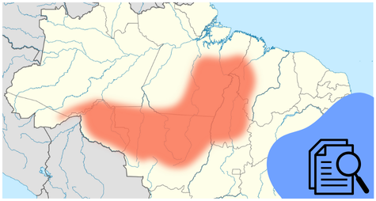
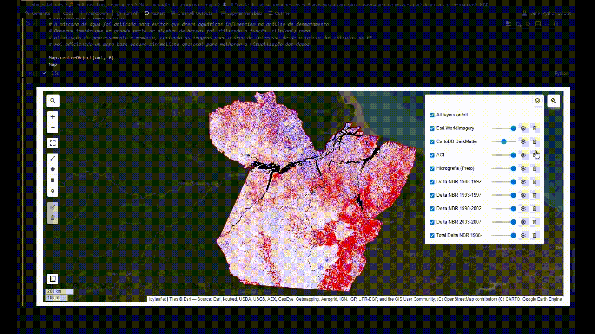

# Projeto de Estudo do Arco do Desmatamento no Pará (1988 - 2007)


# Índice 
* [Descrição do Projeto](#descrição-do-projeto)
* [Status do Projeto](#status-do-projeto)
* [Funcionalidades e Demonstração da Aplicação](#funcionalidades-e-demonstração-da-aplicação)
* [Técnicas e Tecnologias Utilizadas](#técnicas-e-tecnologias-utilizadas)
* [Acesso ao Projeto](#acesso-ao-projeto)
* [Autores](#autores)


# Descrição do Projeto
Este é um projeto de iniciativa independente com a finalidade de estudo e aplicação de técnicas de **Processamento Digital de Imagens (PDI)**, **Geoprocessamento**  e **ferramentas que compõem um SIG**.

O foco central é a análise temporal do **Arco do Desmatamento no estado do Pará**, utilizando a série histórica de satélites Landsat para compreender a evolução da supressão vegetal entre os anos de **1988 e 2007**.

As tecnologias alvo deste estudo são, majoritariamente, a Google Earth Engine API, Python, geemap, folium e QGIS.

### Objetivos Principais
* **Aplicação Técnica:** Demonstrar o uso da API do Google Earth Engine (GEE) integrada ao Python para processamento em nuvem de grandes volumes de dados.
* **Análise Científica:** Reproduzir e validar padrões de desmatamento observados por órgãos oficiais (como o INPE/Terra Brasilis) através de metodologias próprias.
* **Desenvolvimento de SIG:** Exercitar o gerenciamento de layout cartográfico e automação de fluxos de trabalho (criação de pipelines) para sensoriamento remoto.

### Contexto Tecnológico
A infraestrutura do projeto foi construída majoritariamente em **Python**, utilizando bibliotecas de análise geoespacial (`geemap`, `folium`) e integrando resultados visuais com softwares de SIG Desktop (**QGIS**) para refinamento cartográfico.

### Referência visual
A imagem a seguir foi extraída do site [Terra Brasilis](http://terrabrasilis.dpi.inpe.br/), uma plataforma web desenvolvida pelo INPE para acesso, consulta, análise e disseminação de dados geográficos gerados pelos projetos de monitoramento da vegetação nativa do instituto como o PRODES e o DETER. Esta imagem serve como referência visual e meta de validação para este projeto. Ela ilustra o desmatamento consolidado (em amarelo) nos biomas Amazônia e Cerrado. O objetivo deste código é alcançar resultados analíticos comparáveis utilizando dados brutos do Landsat 5 e 7.


### Sobre a metodologia e os resultados
A abordagem metodológica baseou-se no processamento em nuvem utilizando o Google Earth Engine (GEE) para analisar a série temporal histórica de 1988 a 2007.

**Processamento de Imagens:**
* **Coleções de Satélite:** Foram utilizadas as coleções *Surface Reflectance* (Nível 2) dos satélites **Landsat 5 (TM)** e **Landsat 7 (ETM+)**.
* **Mosaicos Anuais (Redutor de Mediana):** Para mitigar a alta incidência de nuvens na região Amazônica, não foram utilizadas cenas individuais, mas sim mosaicos anuais gerados através do cálculo da mediana de todos os pixels disponíveis no ano. Isso gerou imagens sintéticas livres de nuvens e ruídos.
* **Máscara de Água:** Para evitar falsos positivos em corpos hídricos (rios variando de leito), foi aplicada a máscara global do **JRC Global Surface Water**, removendo áreas historicamente alagadas da análise e renderizando-as em preto para contraste (similar ao estilo da imagem do INPE anexada na Descrição).

**Índice Espectral (NBR):**
Optou-se pelo uso do **NBR (Normalized Burn Ratio)** em vez do NDVI, pelo fato do NDVI saturar tanto com florestas quanto com pasto saudável e agricultura, ocorrendo de identificar erroneamente estes dois últimos como "floresta". Por sua vez, o NBR utiliza as bandas do Infravermelho Próximo (NIR) e Infravermelho de Ondas Curtas (SWIR), sendo mais eficaz para diferenciar estrutura florestal complexa de solo exposto e áreas de corte raso.

$$NBR = \frac{(NIR - SWIR)}{(NIR + SWIR)}$$

**Cálculo de Mudança (Delta):**
O mapeamento do desmatamento foi realizado através da diferença (*Delta*) entre o NBR do ano inicial e do ano final de cada quinquênio.
* **Vermelho:** Indica perda significativa de biomassa (Avanço do Desmatamento).
* **Branco:** Indica estabilidade (Sem mudança significativa).
* **Azul:** Indica ganho de biomassa (Regeneração).

**Observação sobre Resultados (Nordeste do Pará):**
É possível notar que a região nordeste do estado (Zona Bragantina/Salgado) apresenta poucas áreas em vermelho (mudança). Isso ocorre pois trata-se de uma área de **desmatamento consolidado**, onde a supressão da vegetação ocorreu majoritariamente antes de 1988 (início da série histórica deste projeto). O método *Delta* foca na detecção de *novos* desmatamentos (incremento), diferindo em alguns aspectos de mapas de uso do solo que mostram o acumulado total, como é o caso da imagem utilizada como parâmetro de sucesso deste projeto.

# Status do Projeto
> ### 🛠️ Projeto em construção 🛠️


# Funcionalidades e Demonstração da Aplicação
### Automações no tratamento de Coleções
Existem funções que criam datasets de séries temporais e tratam as Coleções Landsat com máscaras previamente criadas


### Máscaras de nuvens, água e fatores de escala (saturação de pixels)
O notebook contém funções comentadas e detalhadas sobre o tratamento de Coleções Landsat, além de uma célula que permite a visualização da imagem resultante do tratamento, a qual é utilizada no cálculo do Índice de NBR utilizado na análise posterior.


### Partições contendo intervalos de 5 anos das medianas das Coleções indiciadas com NBR  
É possível observar a diferença de desmatamento total, ou em períodos de 5 anos a partir de 1988 até 2007



# Técnicas e Tecnologias Utilizadas
-  ``Python``
-  ``Jupyter Notebooks``
-  ``Javascript``
-  ``QGIS``
-  ``Google Earth Engine API``
-  ``Geemap``
-  ``Folium``
-  ``Git``
-  ``Manipulação de imagens de SIG vetorizadas``
-  ``Álgebra de bandas``
-  ``Criação de máscara de nuvem e água``
-  ``Indiciamento de vegetação``

# Acesso ao Projeto

Para executar este projeto localmente, você precisará ter o Python instalado e uma conta ativa no Google Earth Engine.

### 1. Clonar o repositório
```bash
git clone https://github.com/ArthurSantos2710/Brasil-DeforestationArc-GEEAPI.git
cd Brasil-DeforestationArc-GEEAPI
```

### 2. Configurar o ambiente virtual (Recomendado)

```bash
# Cria o ambiente virtual
python -m venv venv

# Ativa o ambiente (Windows)
.\venv\Scripts\activate

# Ativa o ambiente (Linux/Mac)
source venv/bin/activate
```

### 3. Instalar dependências
Certifique-se de ter instalado no seu ambiente de execução as bibliotecas requisitadas pelo projeto  

```bash
pip install -r requirements.txt
```

### 4. Autenticação do Google Earth Engine
Ao rodar o notebook pela primeira vez, a biblioteca geemap solicitará autenticação. Ou você pode autenticar via terminal:

```bash
earthengine authenticate
```

### 5. Executar
Abra o Jupyter Notebook e execute os arquivos .ipynb:


```bash
jupyter notebook
```

# Autores
| [<br><sub>Arthur H. Z. dos Santos</sub>](https://github.com/ArthurSantos2710) |
| :---: |
